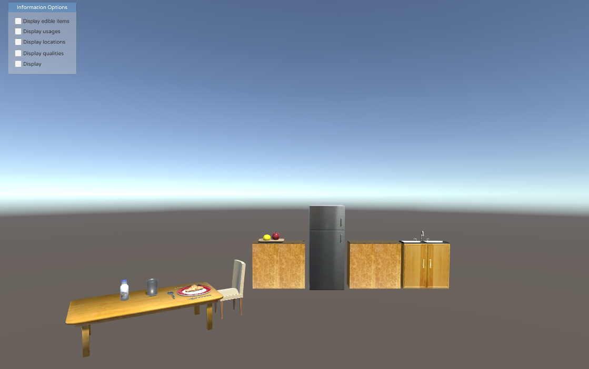

# Kitchen Robot Knowledge Graph
> Knowledge graph enabled vritual reality for a kitchen domain robot

## Introduction
This is the Masters thesis project of Anna de Groot. The project investigates the use of structured sources from the web to create a knowledge graph that can provide kitchen-related commonsense information to a kitchen domain robot. Specifically, information is extracted from [ConceptNet](http://conceptnet.io/) and the [RecipePuppy API](http://www.recipepuppy.com/about/api/). After a knowledge graph prototype is built, it is implemented in a virtual reality game application. 

The project was completed in collaboration with the Institute of Artificial Intelligence at the University of Bremen (<https://ai.uni-bremen.de/>). 